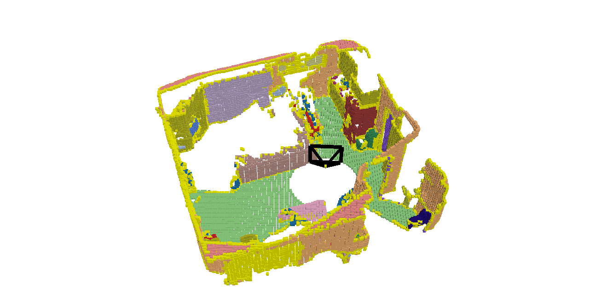

# OccGTGenerator


## Description
This is a tool for semantic occupancy prediction groundtruth generation. The user can input the source data, including the semantic images, depth images, intrisic and extrinsic parameters with COLMAP format. The tool can generate the local and global pointcloud and occupancy prediction.

## Results show

#### -- input data


## -- global occupancy gt


## -- vis local occupancy 


## -- vis global occupancy



## Env setup

python 3.9.19 

```
$ conda env create -n OccGTGenerator --file environment.yml
$ conda activate OccGTGenerator
```

## QuickStart

    $ cd OccGTGenerator
    $ python habitatocc.py

## Pay attention

We use COLMAP format for intrisic and extrinsic parameters. But the qvec is xyzw, not wxyz as usual.

## TODO

- [x] Release the project code v1.0
- [ ] Add function: Visualize the occupancy from the movement trajectory input.
